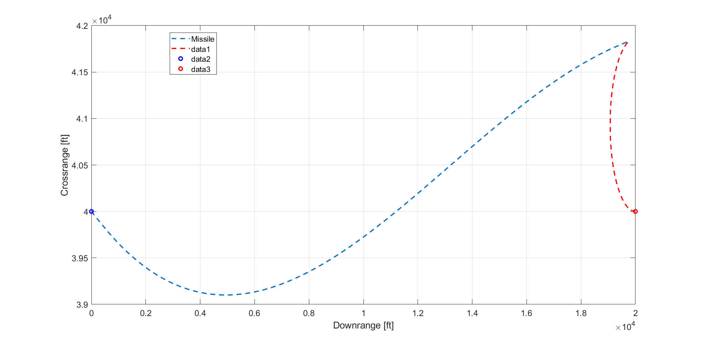
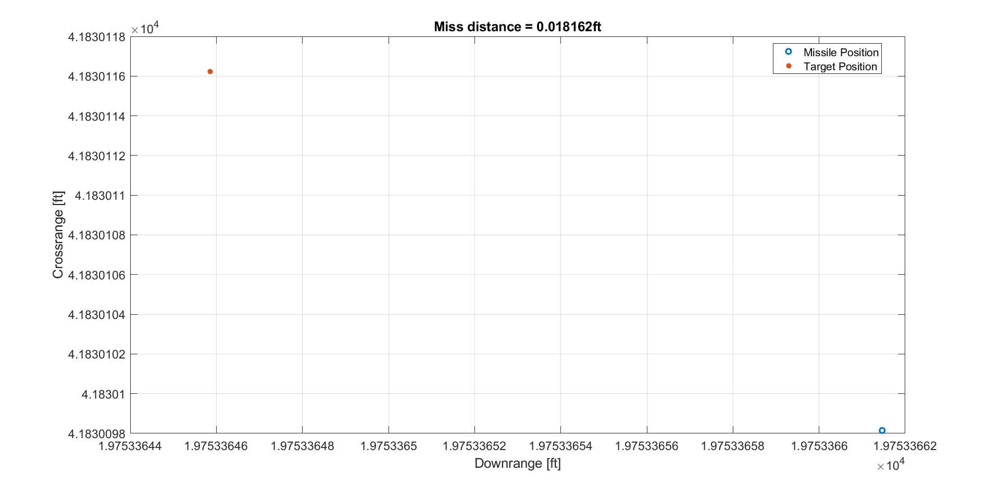

# Robust-control-project

## SUMMARY
**In this project an output feedback system to track the vertical acceleration of a medium range air-to-air missile (MRAAM) is
designed and used in a True proportional navigation guidance law to intercept a target drone
with minimum miss distance. The missile’s short period dynamics are used for this purpose.
Robust servomechanism theory and a Luenberger observer is used in the design.   
The project is divided in 2 parts, A and B. Part A consists of designing the closed loop
system with the design requirements mentioned, using full state feedback first, and then using
output feedback with Acceleration and pitch rate as the outputs. Design charts are created at all significant points to get an intuition of the trends and aid in choosing the optimal gains.**

**In part B, the designed closed loop system is then incorporated in the guidance law and
minimum miss distance is evaluated. At this time changes in design are made if required.**   

**Please refer to the Report pdf for detailed design description.**

###  PART A (Autopilot Design)
#### Design requirements:
* At least 6 dB of gain and 35 degrees of phase margin.
* Maximum fin displacement of 35 degrees.
* Maximum fin rate of 350 degrees per second
* Loop gain at input crossover frequency less than 1/3 the actuator natural frequency.
* Percent undershoot less than 10%.
* Percent overshoot less than 10%.
* Sensitivity and co-sensitivity less than 6dB over 1e-1 to 1e3 rad/s.
* Compensator loop gain within 0.25 Hz of the LQR loop gain at the plant input.
* Real part of the closed loop compensator eigenvalues greater than -500.  
<!---->
### PART B (Drone Intercept Simulation)
The pilot identifies the oncoming drone at the altitude of 40,000 ft. The drone is approaching the 
piloted aircraft head on and flying with zero flight path angle at 300 ft/s resolved in the x-axis of 
the drone body coordinate system that points out the nose. The pilot fires the interceptor missile 
with a -20-degree heading error. Upon firing the missile, the drone pulls an evasive 3 g 
acceleration maneuver normal to its velocity vector.  
Simulate the above scenario with the nonlinear proportional navigation law, integrate the missile autopilot in the guidance homing loop and achieve a minimum miss distance from the target. The structural limitations of the missile allow for a maximum 20g acceleration.
<!---->
   
  

